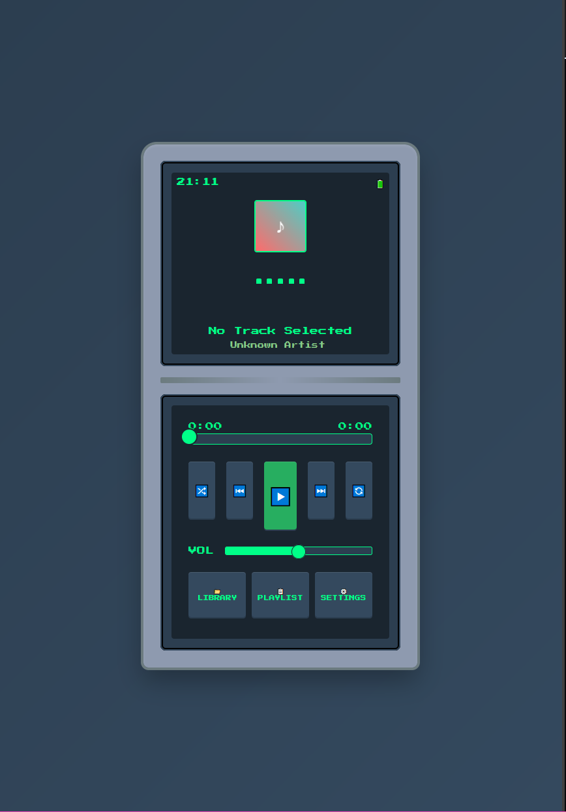

# 🎵 ChiptuneBox

A lightweight, retro pixel-art MP3 player — built for mobile browsers with DS-era vibes.

---

## 📱 About

**ChiptuneBox** is a dual-screen, DS-inspired MP3 player designed for mobile phones. It captures the nostalgia of early 2000s handheld UI while using modern web technologies under the hood.

- Responsive dual-screen layout (top = display, bottom = controls)
- Pixel-art aesthetic, neon glow, and low-res font styles
- Touch-first controls and buttery-smooth audio playback
- Supports reading ID3 metadata (title, artist, album, cover)
- Playlist interface with click-to-play functionality
- Lightweight, vanilla HTML/CSS/JS — no frameworks

---

## 🚀 Features

- ✅ Play / Pause / Skip / Seek
- ✅ Real-time progress and volume control
- ✅ MP3 metadata display (title, artist, album art)
- ✅ Mobile-friendly file selection with multi-file support
- ✅ Folder-as-playlist selection (💻 PC only — mobile support coming)
- ✅ Playlist modal with touch support
- ✅ Auto-scrolling long text (pixel marquee)
- ✅ Theme skins inspired by Mario, Pokémon, Zelda, and more
- ✅ Upload and browse community-shared tracks
- ✅ Notification controls (Media Session API)

---

## 📂 How to Use

You have two options:

### 🕸️ Use the Website  
Open the app directly in your mobile browser at:  
**[https://chiptunebox--justaleks.on.websim.com](https://chiptunebox--justaleks.on.websim.com)**  
_(This is the main version. No redirect needed!)_

### 📦 Or Download the APK  
If you prefer an app-style experience, download the **ChiptuneBox APK** from the [Releases](https://github.com/justAleks0/ChiptuneBox/releases) section on GitHub.  
Runs like a native Android app.

---

## ⚙️ Tech Stack

- HTML5
- CSS3 (Pixel Art + Flexbox)
- Vanilla JavaScript
- FileReader API
- WebSim database
- Mobile-first + scalable desktop layout

---

## 📦 Version

**v1.0.1**  
Minor patch — direct-load now opens WebSim version without redirects.

---

Made with nostalgia by [justAleks](https://github.com/justAleks)
